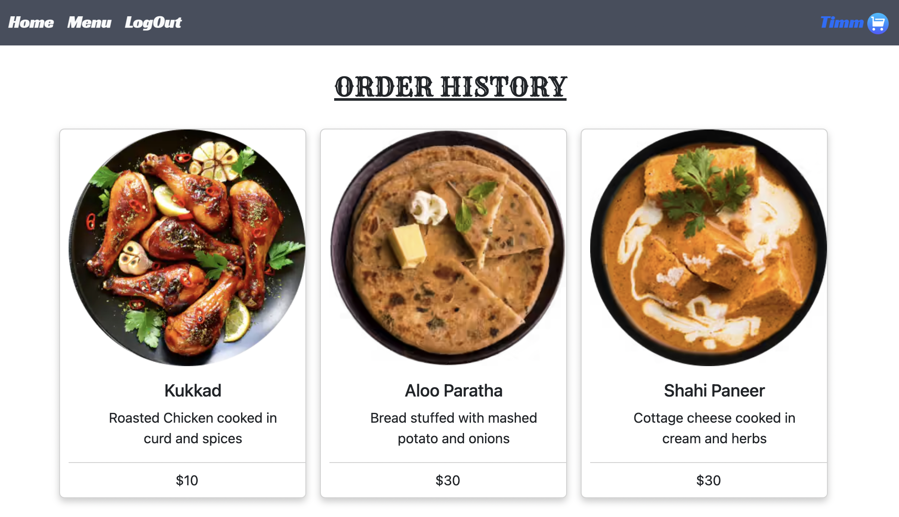

# Restaurant's Food Ordering Application

### Deployed Link to the website
https://projectfood.fly.dev/

# User Story
- This is a food application of a `Restraunt` named - `INDI EATS`
- Users will have to sign-up and login to add items to cart and place order.
- Customers can also place orders for a dish that they like. For this they will be able to add the recipe to the cart
- They will see addtional sections - 'About' and 'Contact us' section

- `Signup`
- `Login`
- `Logout`

- `View Present Cart`
- `Bestseller items are displayed with a green tick`

- `Place Order`
- `View Order History`

- `Footer links`
    - `Location`
    - `Scan QR Code`
    - `Contact Us`
    - `Social Media Icons`
    - `Privacy Policy`


BONUS
- Order Feature
- Add to cart feature
- About and Contact us in the footer section

# Technologies Used

1. HTML5
2. CSS
3. Java Script
4. Node.js
5. Mongoose/MongoDB
6. Express.js
7. Liquid

# Wireframes

1. Home Page


2. About Us


3. Menu Page


4. Client Dashboard Page


5. Present Cart Page


6. Payment Page


7. Order History Page




# URL GUIDE

#### Users

| **URL**          | **HTTP Verb**|**Action**|
|------------------|--------------|----------|
| /users/signup    | GET         | new  
| /users/signup    | POST         | create  
| /users/login     | GET         | login       
| /users/login     | POST         | create       
| /users/logout    | DELETE       | destroy   

#### Menu

| **URL**            | **HTTP Verb**|**Action**|
|--------------------|--------------|----------|
| /menu              | GET          | index    |
| /menu/aboutus      | GET          | show     |


#### CART

| **URL**                | **HTTP Verb**|**Action**                              |
|------------------------|--------------|----------------------------------------|
| /cart                  | GET          | Active true Cart  
| /cart/payment          | GET          | index      
| /cart/checkout         | GET          | Cart History  
| /cart/checkout/:cartId | PUT          | (Active true to false)
| /show/:cartId          | GET          | Current Cart in use    
| /cart/:menuId          | GET / POST   | Push items - in existing or Create Cart  
| /cart/:id      | DELETE       | destroy  


# Models - ERD

1. User

```.js
const UserSchema = new Schema(
	{
		username: { 
			type: String, 
			required: true, 
			unique: true 
		},
		password: { 
			type: String, 
			required: true 
		},
		email: {
			type: String, 
			required: true 
		}
	},
	{ timestamps: true }
)

```
2. Menu 

```.js
const menuSchema = new Schema(
	{
		category: { 
			type: String, 
			required: true 
		},
		name: { 
			type: String, 
			required: true 
		},
		img:{
        	type: String
    	},
        price: {
			 type: Number,
			required: true 
		},
		description: { 
			type: String, 
			required: true 
		},
		bestseller: { type: Boolean, required: true },

		owner: {
			type: Schema.Types.ObjectID,
			ref: 'User',
		}
	},
	{ timestamps: true }
)

```

3. Cart 

```.js
const cartSchema = new Schema ({
    items:[
        {type: Schema.Types.ObjectId,
        ref: 'Menu'} 
    ],
    owner: {
        type: Schema.Types.ObjectId,
        ref: 'User',
        required: true
    },
    active: {
        type: Boolean,
        default: true
    }
    
},{
    timestamps: true,
    toObject: { virtuals: true },
    toJSON: { virtuals: true }
}
)

```
